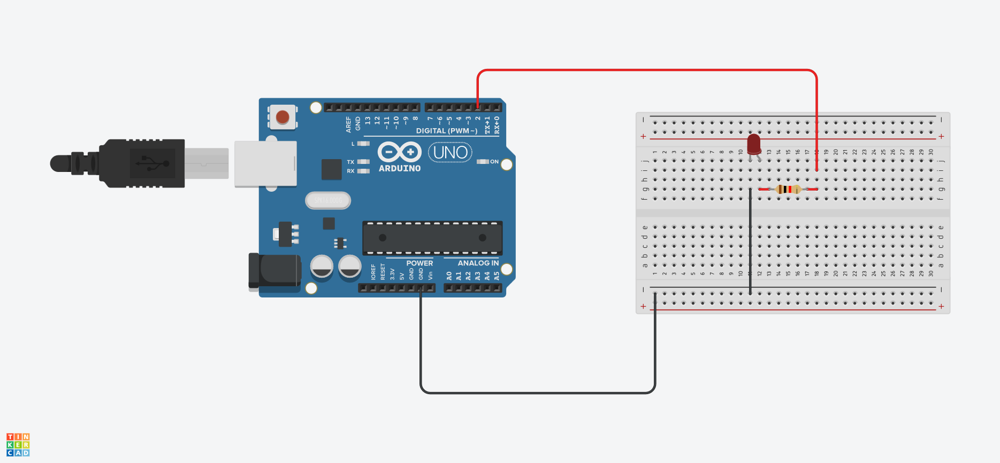
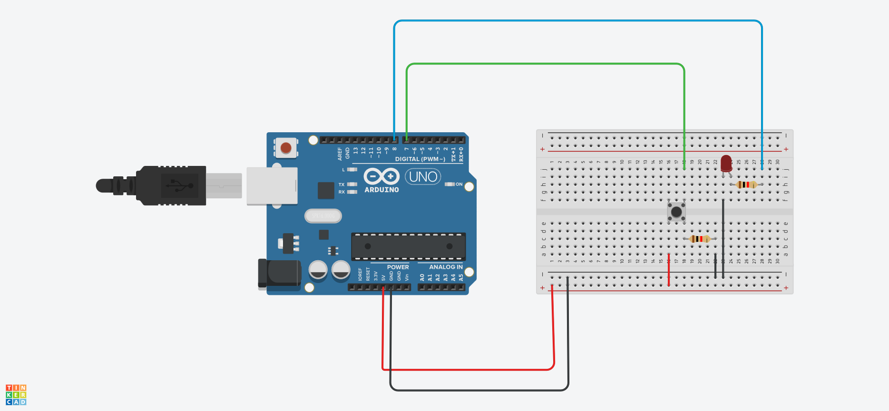
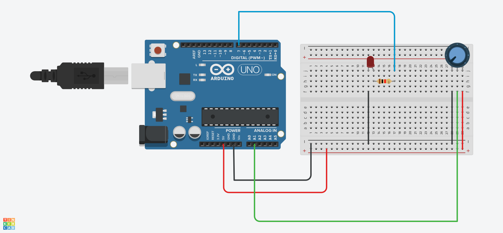

# LED Interface With Arduino

This repository is dedicated to **interfacing LEDs with Arduino UNO**.  
It starts with simple projects such as **LED blinking**, **LED fading**, and **brightness control with potentiometer**, and will keep growing with new ideas, schematics, and code.

---

## 📌 Table of Contents

- [Introduction](#introduction)
- [Hardware Required](#hardware-required)
- [Getting Started](#getting-started)
- [Projects](#projects)
- [Circuit Diagram](#circuit-diagram)
- [Code](#code)
- [Contributing](#contributing)
- [License](#license)

---

## 🔎 Introduction

This repo is for beginners who want to learn Arduino basics using LEDs.  
Through these projects, you’ll understand:

- Digital output (turning LED ON/OFF)
- PWM (for LED fading)
- Analog input (brightness control using potentiometer)

---

## 🔧 Hardware Required

- Arduino UNO (or compatible board)
- LEDs (any color)
- Resistors (220Ω recommended)
- Breadboard + jumper wires
- Potentiometer (for brightness control project)

---

## 🚀 Getting Started

1. Clone this repository:
   ```bash
   git clone https://github.com/Yogesh-Baskaran14/Arduino_LED.git
   ```

## 💡 Projects

This section will contain details for each project:

- **LED Blinking:** The classic "Hello World" of microcontrollers.
- **LED Blinking With Push Buttom:** The classic "Hello World" of microcontrollers with push button.
- **Brightness Control with Potentiometer:** Reading analog input to dynamically set LED brightness.
- **LED Fading:** Using Pulse Width Modulation (PWM) to create a smooth fade effect.

---

## 🔌 Circuit Diagram

Schematics for each project will be provided here, typically as Fritzing or image files.

- **LED Blinking Diagram:**
  

- **LED Blinking With Push Button Diagram:**
  

- **Brightness Control with Potentiometer Diagram:**
  

---

## 💻 Code

You will find the complete Arduino sketches (`.ino` files) for all projects in this section's directory.

### 💡 Project Code Steps

1.  **Locate the Code:** Navigate to the main directory of this repository. All code files are organized within the dedicated **`Code/`** folder.
2.  **Open the Sketch:** Open the desired project file (e.g., `Blinking/Blinking.ino`) using the **Arduino IDE**.
3.  **Connect Your Board:** Connect your Arduino UNO board to your computer via a USB cable.
4.  **Select Board and Port:** In the Arduino IDE, go to `Tools` $\rightarrow$ `Board` and select **"Arduino Uno"**. Then, go to `Tools` $\rightarrow$ `Port` and select the appropriate communication port (e.g., COM3 or `/dev/ttyACM0`).
5.  **Upload the Code:** Click the **Upload** button (the right arrow icon) in the Arduino IDE to compile and flash the sketch onto your board.
6.  **Verify:** After a successful upload, your Arduino will execute the code (e.g., the LED connected to Pin 13 should start blinking).

### LED Blinking Code

To display a code snippet, use fenced code blocks and specify the language (`arduino` or `cpp`) for syntax highlighting:

````arduino
// The classic LED blink sketch
const int ledPin = 13;

void setup() {
  pinMode(ledPin, OUTPUT);
}

void loop() {
  digitalWrite(ledPin, HIGH); // Turn the LED on
  delay(1000);                // Wait for a second (1000 milliseconds)
  digitalWrite(ledPin, LOW);  // Turn the LED off
  delay(1000);                // Wait for a second
}

## 🤝 Contributing

We welcome contributions from the community\! If you have new LED projects, cleaner code, or schematic improvements, please follow these steps:

1.  **Fork** the repository on GitHub.
2.  **Clone** your forked repository:
    ```bash
    git clone https://Yogesh-Baskaran14/Arduino_LED.git
    ```
3.  Create a new **branch** for your feature or fix:
    ```bash
    git checkout -b feature/new-project
    ```
4.  Make your changes, test them, and **commit** them with a clear message.
5.  **Push** your branch to GitHub.
6.  Open a **Pull Request (PR)** from your forked repository back to the `main` branch of this repository, describing your changes.

---

## 📜 License
````
